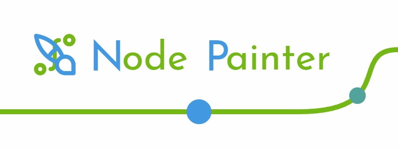

# NodePainter

Node Painter is a browser-based visual programming tool designed to create procedural animations.

It uses a declarative approach to animation. Instead of saying "Increase the x coordinate of the circle" you say "I want a circle and I want its X coordinate to depend on the time". I like this approach because it makes looping animation easier to conceive; however it makes some algorithms impossible. I've implemented a few workarounds such as the simulation node, but Node Painter is
overral not designed for those type of projects.

There is a wide variety of nodes to choose from, from simple math (including vector math) to image manipulation. Some examples include the Paint Image node which lets you draw a simple image directly in the app; the "For" node which lets you repeat an instruction multiple times; the "Progress" node gives you a simple indicator of where you are in the animations or even the "Render 3D"
node which, as its name implies, renders some 3D objects to an image.  

You can even create your own custom functions if you need to. There's also the option to create custom shaders, still using the same graph-based approach.  
You can also create simulations. Simulations are custom functions which are passed as inputs their own results from the previous frame. This allows for the creation of simple behaviour like a trail or movement integration.

Most node have inputs of various types that can be set directly or linked to other nodes. Some also have settings that cannot be changed dynamically. A lot of nodes support multiple types of input or output. You can change them using the little tabs on top. 

If you need mathematical constants (Like PI), you can get them as nodes or you can type them directly in number fields, as they support math expressions.

You can export your animation as GIF or as WebM video file. Additionally you can save your sketch in your browser or download it as a json file.

Node Painter is built in [TypeScript](https://www.typescriptlang.org/) using [React](https://react.dev/). I also use [P5.js](https://p5js.org/) for the 2d rendering and [Three.js](https://threejs.org/) for 3D, as well as several other libraries such as StyledComponent (for easy CSS manipulation), Zustand (for state management) or React-Spring (for UI animation). 

I first started making Node Painter in november 2023 and have been working on it on and off since.

I initially started the project because I often get the urge to prototype ideas for animation when I'm away from my computer. I wanted something on my phone to program while I'm in bed or on the go but all the options were not made specifically for visual effect or used hard-to-type code. It is a follow-up to the other browser-based creative apps I've made over the years: [Mesh Playground](https://meshplayground.grifdail.fr/) (Create 3D mesh with code), [Doodle Playground](https://doodleplayground.grifdail.fr/) (Draw 3D world) and [Draw Me A Gif](https://drawmeagif.grifdail.fr/) (Draw flipbook animation).

