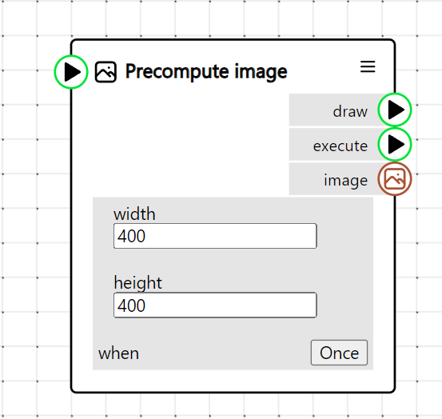

# NodePainter

A tool to make visuals and animation programmatically through a graph-based editor.

Documentation in progress.

## Getting started

In node painter you can use node to describe what you want to see.

Most node have options that you can link to other nodes to make them behave in specific ways.
Some nodes have special green ports, those are "Execute" ports. Unlike other port, they don't pass around data, but instead tell the engine what to execute, and in which order.
For instance, the `Draw Circle` node will draw a circle. It has some options for color, position and radius. It also has an execute port. In the image above we've connected the color port to the `Pick from palette` node which is itself connected to the `multiply` and `Progress` node. That way the circle will change color as the animation advances. We connected the execute port to the `Then` node (which will execute nodes, one after the other) and finally to the `Start` node.

To start adding nodes, click on the "+" button on the top left of the screen.

To connect them, click on the port you want to connect, then click on the other port. Click on the same port if you want to cancel. To disconnect a port, click on the input port you want to disconnect.

Finally, to test your sketch, click on the "Play" icon on the top left corner, next to the "+" button.

## Special node to know

#### Start

The start node is the origin of the sketch. All the instructions must be connected to it. This is also where you'll be able to name your sketch and set its dimensions.

#### Then

As mentioned previously, the then sketch will execute the node connected to its port in order, from top to bottom. You can add more ports by selecting the option in the menu, in the top right corner of the node.

#### Progress

`Progress` will output a number that increases from 0 to 1 in the duration specified in its setting before looping back to 0. This is extremely useful to make loops as you can time your animation to that node. All instances of the `Progress` node share the same duration parameter and the `Export gif` feature will also use that value by default.

#### Math nodes

Most math nodes feature a little type selector at the top. You can use that to change the type of the node you're working with. For instance, the add or multiply function makes sense for numbers, vectors and colors.

All input that accepts numbers will also accept math expressions. For instance, you could write "4\*3", "sqrt(2)" or "pi" and they will automatically be turned into "12", "1.41421356237" and "3.14159265359". Although nodes representing mathematical constants exist, this is the recommended way to use them. We even support "tau" (2pi).

#### For & For Grid

`For` is a special node used to repeat an instruction multiple times.
While the loop is executing, it will output through its `Index`` port the count of the current loop.

`For Grid` is a variation of the `For` node that loops through two dimensions at the same time

#### Random

Node Painter uses a pseudo-random number generator. The PRNG is consistent across frames meaning `Random` node will return the same value every frame however it will give a different value every time it's called within the same frame.
One way to visualize this is to imagine a big list of random values. Each time we call `Random` we remove the first element from the list and return it. At the end of each frame, we reset the list exactly how it was initially.
In practice, that's useful because it means, if you place stuff randomly in a `For` node for instance, these stuffs will stay in the same place and not jump around every frame.
However, it also means it's not possible to reuse the result of a `Random` node multiple times as it will trigger a new evaluation of the node and therefore a new value. Unless you use a `Precompute` node.

#### Precompute

When executing, the `Precompute` node will evaluate all of its input ports and output them when executing its 'child' node. That means they won't get reevaluated every time. Random values will stay the same and expensive computation will not be done multiple times.

#### Render with Transform Nodes

These series of nodes, `Render with translation`, `Render with rotation` and `Render with scale` will execute their child node as if they were being moved, rotated or scaled.

#### Render in 3D

Node painter's main canvas doesn't support 3D rendering. To show 3D visual, you need to to actually render it into an image and then draw that in the main canvas. That's what the `Render in 3D` node does. Node executed by its "Draw" port will be executed in a special 3D context and rendered to an image that can be accessed in the "Execute" port.
That image is not cleared between frames so you might want to use a `Clear` or `Fill background` node here too.

3D nodes will only execute in that special context but some 2D drawing functions also work in 3D too.

#### Precompute Image

`Precompute image` work exactly like `Render in 3D` except the drawing gets executed in a normal, 2d, canvas.

